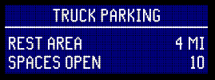

# Quick Messages

Select `View ➔ Message Signs ➔ Quick Messages` or
`View ➔ Message Signs ➔ Message Editor` menu items

A _quick message_ is a fully composed [MULTI] message which can be associated
with a sign group.  They are created using the [WYSIWYG editor].

Quick messages can be selected directly by operators, or activated by [DMS
action]s as part of an [action plan].  For these messages, it is best to
leave the sign group blank.

## Message Combining

It is sometimes necessary to display two messages on a sign at the same time.
This is controlled with the quick message _Combining_ field:

Combining | Description
----------|--------------------
Disable   | May not be combined
First     | May combine as first message
Second    | May combine as second message
Either    | May combine as first or second message

Messages can only be combined in certain cases:
- The first message is scheduled by a [DMS action] and the second is selected by
  an operator.
- Both messages are selected by an operator, the first being a quick message and
  the second composed (line-by-line).

The foreground color, font, and justification are reset to default values
before the second message.  The [MULTI] string `[cf][fo][jl][jp]` is inserted
automatically.

There are two methods of combining messages: **Shared** and **Sequenced**.

### Shared Message Combining

With this method, the sign is partitioned into two regions, displaying both
messages simultaneously.

- The first message must end with a `[tr…]` (text rectangle) tag.
- The first message must contain no `[np]` tags.
- The second message must contain no `[tr…]` tags.

The first message is prepended to each page of the second message.  If the
resulting combined message cannot be displayed on the sign, the second message
will be used with **NO** combining.

Example:  
- First message:
  `[cr1,1,240,24,1,23,9][cf250,250,250][fo13][tr1,5,240,18][jl3]EXPRESS LANE[tr1,31,240,40]OPEN TO ALL[nl6]TRAFFIC[g7,110,75][cr241,1,2,96,255,255,255][tr243,1,350,96]`
- Second message:
  `STALLED VEHICLE[nl]IN RIGHT LANE[nl]USE CAUTION`
- Combined message:
  `[cr1,1,240,24,1,23,9][cf250,250,250][fo13][tr1,5,240,18][jl3]EXPRESS LANE[tr1,31,240,40]OPEN TO ALL[nl6]TRAFFIC[g7,110,75][cr241,1,2,96,255,255,255][tr243,1,350,96][cf][fo][jl][jp]STALLED VEHICLE[nl]IN RIGHT LANE[nl]USE CAUTION`

### Sequenced Message Combining

When the criteria for shared combining are not met, the messages are combined in
a repeating _sequence_ of pages.  The messages are separated by an `[np]` tag.

Example:
- First message:
  `[cr1,1,160,54,0,0,125][cr1,18,160,1,255,255,255][tr1,1,160,17][cf255,255,255][fo5][jp3]TRUCK PARKING[tr4,24,154,30][jl2]REST AREA[jl4]4 MI[nl5][jl2]SPACES OPEN[jl4]10`
- Combined message:
  `[cr1,1,160,54,0,0,125][cr1,18,160,1,255,255,255][tr1,1,160,17][cf255,255,255][fo5][jp3]TRUCK PARKING[tr4,24,154,30][jl2]REST AREA[jl4]4 MI[nl5][jl2]SPACES OPEN[jl4]10[cf][fo][jl][jp][np]STALLED VEHICLE[nl]IN RIGHT LANE[nl]USE CAUTION`

[action plan]: action_plans.html
[DMS action]: action_plans.html#dms-actions
[MULTI]: multi.html
[WYSIWYG editor]: wysiwyg.html
