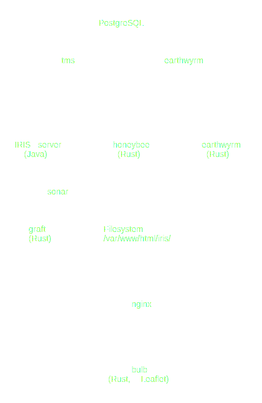

# Web User Interface

This document tracks progress on the web-based user interface for IRIS.

## Phase 1 — Segment Map

### earthwyrm

[Earthwyrm] is a web mapping service for [MVT], or Mapbox Vector Tiles.  Layers
can be made from [OpenStreetMap] data in addition to IRIS devices, such as DMS.

- [X] Serve MVT for OpenStreetMap layers
- [ ] Update to use [MuON] for configuration

### honeybee

Honeybee is a web service for JSON data in addition to rendered GIF images of
DMS.  It is included in the IRIS repository.

- [X] Generate JSON for cameras, DMS, etc.
- [ ] Generate segment map layer in earthwyrm DB

## bulb

Bulb is the web front-end for IRIS.  The mapping portion uses the [Leaflet]
JavaScript library.  The rest of the code is written in Rust, compiled as
WebAssembly.

- [X] Set up build using wasm-pack
- [ ] Integrate leaflet map
- [ ] Style segment layer with detector data

## Phase 2 — DMS control

### honeybee

- [X] Generate GIF images for DMS
- [ ] Generate DMS map layer in earthwyrm DB
- [ ] Turn into web service (warp)
- [ ] Send SSE for DMS notifications
- [ ] Add endpoints for controlling DMS
- [ ] Connect to IRIS server with sonar
- [ ] Authentication using sonar

## bulb

- [ ] Connect to honeybee for SSE
- [ ] UI for DMS viewing / control
- [ ] Generate DMS previews and insert into img element using data URI

[earthwyrm]: https://github.com/DougLau/earthwyrm
[Leaflet]: https://github.com/Leaflet/Leaflet
[MuON]: https://github.com/muon-data/muon
[MVT]: https://docs.mapbox.com/vector-tiles/reference/
[OpenStreetMap]: https://www.openstreetmap.org
